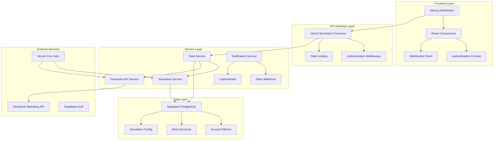
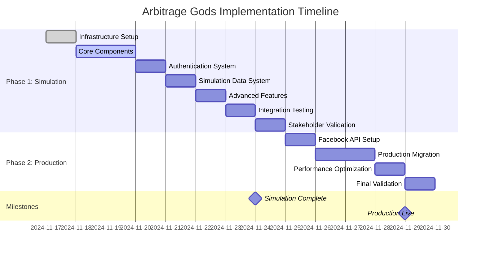

# Arbitrage Gods Facebook Ads Monitoring System
## Production-Ready Implementation Roadmap

**Version:** 1.0.0  
**Status:** Planning Phase  
**Architecture:** Test-Driven Development with Simulation-First Approach  
**Target Domain:** arbitrage-gods.online (ASSUMPTION - requires confirmation)  
**Timeline:** 12 Days (Phase 1: 7 Days, Phase 2: 5 Days)

---

## EXECUTIVE SUMMARY

This roadmap provides a comprehensive implementation strategy for the Arbitrage Gods Facebook ads monitoring system, employing enterprise-grade TDD methodology with a simulation-first approach. The system will monitor 30-100 Facebook ad accounts across multiple Business Managers with real-time suspension detection, spend tracking, and vendor compliance metrics.

**Critical Success Factors:**
- Simulation-first development to eliminate external dependencies
- 95%+ test coverage with Jest/Testing Library
- Microservices architecture on serverless infrastructure
- CI/CD pipeline with automated deployment to Vercel
- Enterprise-grade security and performance standards

---

## 1. ARCHITECTURAL DESIGN & TECHNICAL SPECIFICATIONS

### 1.1 Microservices Architecture



### 1.2 Component Hierarchy Specification

```
pages/
├── index.js                    # Root redirect to /login
├── login.js                    # Supabase authentication
└── dashboard.js                # Protected main dashboard

components/
├── DashboardGrid.js            # 3×3 responsive grid layout
├── AccountCard.js              # Individual account display card
├── SpendProgressBar.js         # Visual spend indicator
├── TrendIndicator.js           # CPC/spend trend arrows
├── VendorFilter.js             # Account filtering by vendor
├── AccountSearch.js            # Search by account ID
├── ErrorBoundary.js            # React error boundary wrapper
└── Layout/
    ├── Header.js               # Navigation and user menu
    ├── Sidebar.js              # Filters and controls
    └── Footer.js               # Status and last update

lib/
├── supabase.js                 # Database client configuration
├── websocket.js                # Real-time subscriptions
├── permissions.js              # RBAC enforcement logic
├── formatters.js               # Currency/percentage utilities
├── validators.js               # Data validation functions
└── constants.js                # Application constants

api/
├── simulate-fb-data.js         # Phase 1 simulation cron
├── fetch-fb-data-production.js # Phase 2 production cron
├── health.js                   # Uptime monitoring endpoint
├── auth/
│   ├── login.js               # Authentication endpoint
│   └── logout.js              # Session termination
└── admin/
    ├── accounts.js            # Account management
    └── users.js               # User management
```

---

## 2. DATABASE SCHEMA VALIDATION & OPTIMIZATION

### 2.1 Production Tables

```sql
-- Account registry with vendor tracking
CREATE TABLE ad_accounts (
  account_id VARCHAR(20) PRIMARY KEY,
  vendor_name VARCHAR(50) NOT NULL,
  business_manager_id VARCHAR(20),
  date_added TIMESTAMP DEFAULT NOW(),
  status VARCHAR(20) DEFAULT 'active',
  archived_at TIMESTAMP NULL,
  created_at TIMESTAMP DEFAULT NOW(),
  updated_at TIMESTAMP DEFAULT NOW()
);

-- Real-time metrics with partitioning
CREATE TABLE account_metrics (
  id BIGSERIAL PRIMARY KEY,
  account_id VARCHAR(20) REFERENCES ad_accounts(account_id),
  snapshot_time TIMESTAMP NOT NULL,
  
  -- Facebook API raw values (cents)
  daily_spend_limit INTEGER,
  spend_cap INTEGER,
  amount_spent INTEGER,
  
  -- Converted display values (dollars)
  spend_today DECIMAL(10,2),
  daily_limit_display DECIMAL(10,2),
  
  -- Calculated metrics
  spend_progress_percent DECIMAL(5,2),
  cpc DECIMAL(6,4),
  outbound_clicks INTEGER,
  active_ads_count INTEGER,
  total_ads_count INTEGER,
  account_balance DECIMAL(10,2),
  
  -- Status tracking
  account_status INTEGER, -- 1=active, 100=suspended
  cap_source VARCHAR(20), -- 'API', 'UNAVAILABLE'
  
  CONSTRAINT unique_snapshot UNIQUE(account_id, snapshot_time)
) PARTITION BY RANGE (snapshot_time);

-- Monthly partitions for performance
CREATE TABLE account_metrics_y2024m11 PARTITION OF account_metrics
  FOR VALUES FROM ('2024-11-01') TO ('2024-12-01');

-- Performance indexes
CREATE INDEX idx_latest_metrics ON account_metrics(account_id, snapshot_time DESC);
CREATE INDEX idx_suspended_accounts ON account_metrics(account_status) WHERE account_status = 100;
CREATE INDEX idx_vendor_accounts ON ad_accounts(vendor_name, status);
```

### 2.2 Simulation Tables (Phase 1)

```sql
-- Mock account configuration
CREATE TABLE mock_ad_accounts (
  account_id VARCHAR(20) PRIMARY KEY,
  vendor_name VARCHAR(50),
  initial_cap_cents INTEGER,
  cap_growth_rate VARCHAR(20), -- 'fast', 'normal', 'slow', 'declining'
  base_cpc DECIMAL(6,4),
  suspension_probability DECIMAL(3,2),
  created_at TIMESTAMP DEFAULT NOW()
);

-- Simulation metrics (identical schema to production)
CREATE TABLE mock_account_metrics (
  -- Same structure as account_metrics
  -- Used during 7-day simulation validation
);

-- Simulation control
CREATE TABLE simulation_config (
  id SERIAL PRIMARY KEY,
  simulation_mode BOOLEAN DEFAULT TRUE,
  update_interval INTEGER DEFAULT 300, -- 5 minutes
  last_update TIMESTAMP,
  accounts_count INTEGER DEFAULT 30,
  suspension_rate DECIMAL(3,2) DEFAULT 0.05
);
```

---

## 3. REACT COMPONENT SPECIFICATIONS WITH TDD

### 3.1 AccountCard Component Tests

```javascript
// components/AccountCard.test.js
import { render, screen, fireEvent } from '@testing-library/react'
import AccountCard from './AccountCard'

describe('AccountCard', () => {
  const mockAccount = {
    account_id: 'act_1234567890',
    vendor_name: 'Agency Alpha',
    spend_today: 247.80,
    daily_limit_display: 250.00,
    spend_progress_percent: 99.1,
    account_status: 1,
    cpc: 0.34,
    outbound_clicks: 4287,
    active_ads_count: 12,
    total_ads_count: 18,
    account_balance: 1847.50,
    snapshot_time: '2024-11-17T15:42:00Z'
  }

  test('displays account information correctly', () => {
    render(<AccountCard account={mockAccount} />)
    
    expect(screen.getByText('act_1234567890')).toBeInTheDocument()
    expect(screen.getByText('Agency Alpha')).toBeInTheDocument()
    expect(screen.getByText('$247.80 / $250.00 (99.1%)')).toBeInTheDocument()
  })

  test('copies account ID to clipboard on click', async () => {
    render(<AccountCard account={mockAccount} />)
    
    const accountId = screen.getByText('act_1234567890')
    fireEvent.click(accountId)
    
    expect(navigator.clipboard.writeText).toHaveBeenCalledWith('act_1234567890')
    expect(screen.getByText('Account ID copied')).toBeInTheDocument()
  })

  test('displays suspended state with red background', () => {
    const suspendedAccount = { ...mockAccount, account_status: 100 }
    render(<AccountCard account={suspendedAccount} />)
    
    const card = screen.getByTestId('account-card')
    expect(card).toHaveClass('bg-red-50', 'border-red-200')
    expect(screen.getByText('SUSPENDED')).toBeInTheDocument()
  })

  test('handles null values gracefully', () => {
    const nullAccount = {
      account_id: 'act_123',
      vendor_name: 'Test Vendor',
      spend_today: null,
      daily_limit_display: null
    }
    
    render(<AccountCard account={nullAccount} />)
    expect(screen.getByText('Data loading...')).toBeInTheDocument()
  })
})
```

### 3.2 SpendProgressBar Component Tests

```javascript
// components/SpendProgressBar.test.js
import { render, screen } from '@testing-library/react'
import SpendProgressBar from './SpendProgressBar'

describe('SpendProgressBar', () => {
  test('displays spend percentage correctly', () => {
    render(<SpendProgressBar spent={75.50} cap={100.00} />)
    expect(screen.getByText('75.5%')).toBeInTheDocument()
  })

  test('shows green color when spend 70-110% of cap', () => {
    const { container } = render(<SpendProgressBar spent={85} cap={100} />)
    const bar = container.querySelector('.progress-bar')
    expect(bar).toHaveClass('bg-green-500')
  })

  test('shows amber color when spend <70% of cap', () => {
    const { container } = render(<SpendProgressBar spent={60} cap={100} />)
    const bar = container.querySelector('.progress-bar')
    expect(bar).toHaveClass('bg-amber-500')
  })

  test('shows red color when spend >110% of cap', () => {
    const { container } = render(<SpendProgressBar spent={115} cap={100} />)
    const bar = container.querySelector('.progress-bar')
    expect(bar).toHaveClass('bg-red-500')
  })

  test('handles cap of $0 gracefully', () => {
    render(<SpendProgressBar spent={50} cap={0} />)
    expect(screen.getByText('Cap unavailable')).toBeInTheDocument()
  })

  test('handles null values gracefully', () => {
    render(<SpendProgressBar spent={null} cap={null} />)
    expect(screen.getByText('Data loading...')).toBeInTheDocument()
  })
})
```

---

## 4. JEST/TESTING LIBRARY FRAMEWORK CONFIGURATION

### 4.1 Jest Configuration

```javascript
// jest.config.js
module.exports = {
  testEnvironment: 'jsdom',
  setupFilesAfterEnv: ['<rootDir>/__tests__/setup.js'],
  moduleNameMapper: {
    '^@/components/(.*)$': '<rootDir>/components/$1',
    '^@/lib/(.*)$': '<rootDir>/lib/$1',
    '^@/pages/(.*)$': '<rootDir>/pages/$1',
    '^@/api/(.*)$': '<rootDir>/api/$1',
  },
  collectCoverageFrom: [
    'components/**/*.js',
    'pages/**/*.js',
    'api/**/*.js',
    'lib/**/*.js',
    '!**/*.test.js',
    '!**/node_modules/**',
    '!**/coverage/**'
  ],
  coverageThreshold: {
    global: {
      branches: 80,
      functions: 80,
      lines: 80,
      statements: 80
    },
    './components/': {
      branches: 90,
      functions: 90,
      lines: 90,
      statements: 90
    }
  },
  testMatch: [
    '**/__tests__/**/*.test.js',
    '**/?(*.)+(spec|test).js'
  ],
  transform: {
    '^.+\\.js$': 'babel-jest'
  }
}
```

### 4.2 Test Setup Configuration

```javascript
// __tests__/setup.js
import '@testing-library/jest-dom'
import { jest } from '@jest/globals'

// Mock Supabase client
jest.mock('@supabase/supabase-js', () => ({
  createClient: jest.fn(() => ({
    auth: {
      getSession: jest.fn(),
      signIn: jest.fn(),
      signOut: jest.fn()
    },
    from: jest.fn(() => ({
      select: jest.fn().mockReturnThis(),
      insert: jest.fn().mockReturnThis(),
      update: jest.fn().mockReturnThis(),
      eq: jest.fn().mockReturnThis(),
      order: jest.fn().mockReturnThis(),
      limit: jest.fn().mockReturnThis()
    }))
  }))
}))

// Mock WebSocket
global.WebSocket = jest.fn(() => ({
  addEventListener: jest.fn(),
  removeEventListener: jest.fn(),
  send: jest.fn(),
  close: jest.fn()
}))

// Mock clipboard API
Object.assign(navigator, {
  clipboard: {
    writeText: jest.fn().mockResolvedValue(undefined)
  }
})

// Mock fetch for API calls
global.fetch = jest.fn()
```

---

## 5. CI/CD PIPELINE CONFIGURATION

### 5.1 GitHub Actions Workflow

```yaml
# .github/workflows/test-deploy.yml
name: Test and Deploy

on:
  push:
    branches: [ main, develop ]
  pull_request:
    branches: [ main ]

env:
  NODE_VERSION: '20'
  NEXT_PUBLIC_SUPABASE_URL: ${{ secrets.NEXT_PUBLIC_SUPABASE_URL }}
  NEXT_PUBLIC_SUPABASE_ANON_KEY: ${{ secrets.NEXT_PUBLIC_SUPABASE_ANON_KEY }}

jobs:
  test:
    runs-on: ubuntu-latest
    
    steps:
    - name: Checkout code
      uses: actions/checkout@v4
    
    - name: Setup Node.js
      uses: actions/setup-node@v4
      with:
        node-version: ${{ env.NODE_VERSION }}
        cache: 'npm'
    
    - name: Install dependencies
      run: npm ci
    
    - name: Run linting
      run: npm run lint
    
    - name: Run tests with coverage
      run: npm test -- --coverage --watchAll=false
    
    - name: Check coverage threshold
      run: |
        if [ $(jq '.total.lines.pct < 80' coverage/coverage-summary.json) ]; then
          echo "Coverage below 80% threshold"
          exit 1
        fi
    
    - name: Upload coverage to Codecov
      uses: codecov/codecov-action@v3
      with:
        file: ./coverage/coverage-final.json

  security-audit:
    runs-on: ubuntu-latest
    
    steps:
    - name: Checkout code
      uses: actions/checkout@v4
    
    - name: Setup Node.js
      uses: actions/setup-node@v4
      with:
        node-version: ${{ env.NODE_VERSION }}
    
    - name: Install dependencies
      run: npm ci
    
    - name: Run security audit
      run: npm audit --audit-level=moderate

  deploy-staging:
    needs: [test, security-audit]
    runs-on: ubuntu-latest
    if: github.ref == 'refs/heads/develop'
    
    steps:
    - name: Checkout code
      uses: actions/checkout@v4
    
    - name: Deploy to Vercel Staging
      uses: amondnet/vercel-action@v25
      with:
        vercel-token: ${{ secrets.VERCEL_TOKEN }}
        vercel-org-id: ${{ secrets.VERCEL_ORG_ID }}
        vercel-project-id: ${{ secrets.VERCEL_PROJECT_ID }}
        vercel-args: '--alias staging.arbitrage-gods.online'

  deploy-production:
    needs: [test, security-audit]
    runs-on: ubuntu-latest
    if: github.ref == 'refs/heads/main'
    
    steps:
    - name: Checkout code
      uses: actions/checkout@v4
    
    - name: Deploy to Vercel Production
      uses: amondnet/vercel-action@v25
      with:
        vercel-token: ${{ secrets.VERCEL_TOKEN }}
        vercel-org-id: ${{ secrets.VERCEL_ORG_ID }}
        vercel-project-id: ${{ secrets.VERCEL_PROJECT_ID }}
        vercel-args: '--prod'
        alias-domains: 'arbitrage-gods.online'
```

### 5.2 Vercel Configuration

```json
// vercel.json
{
  "version": 2,
  "builds": [
    {
      "src": "package.json",
      "use": "@vercel/next"
    }
  ],
  "routes": [
    {
      "src": "/api/(.*)",
      "dest": "/api/$1"
    },
    {
      "src": "/(.*)",
      "dest": "/$1"
    }
  ],
  "functions": {
    "api/**/*.js": {
      "maxDuration": 30
    }
  },
  "crons": [
    {
      "path": "/api/simulate-fb-data",
      "schedule": "*/5 * * * *"
    }
  ],
  "env": {
    "NEXT_PUBLIC_SUPABASE_URL": "@supabase-url",
    "NEXT_PUBLIC_SUPABASE_ANON_KEY": "@supabase-anon-key"
  },
  "domains": [
    "arbitrage-gods.online"
  ]
}
```

---

## 6. SIMULATION ENVIRONMENT SPECIFICATIONS

### 6.1 Mock Data Generator

```javascript
// api/simulate-fb-data.js
import { createClient } from '@supabase/supabase-js'

const supabase = createClient(
  process.env.NEXT_PUBLIC_SUPABASE_URL,
  process.env.SUPABASE_SERVICE_KEY
)

// Realistic spend progression based on time of day
function generateSpendProgress(baseCap, currentTime) {
  const hour = parseInt(currentTime.split(':')[0])
  const dayProgress = Math.min((hour - 6) / 14, 1) // 6 AM to 8 PM
  const randomVariation = 0.9 + Math.random() * 0.2 // 90-110% variation
  
  return baseCap * dayProgress * randomVariation
}

// Dynamic cap growth simulation
function generateCapGrowth(initialCap, daysActive, growthRate) {
  const growthMultipliers = {
    fast: 1.15,
    normal: 1.08,
    slow: 1.03,
    declining: 0.95
  }
  
  const multiplier = growthMultipliers[growthRate] || 1.08
  return Math.floor(initialCap * Math.pow(multiplier, daysActive))
}

// Account status simulation
function simulateAccountStatus(suspensionProbability) {
  return Math.random() < suspensionProbability ? 100 : 1 // 100 = suspended
}

export default async function handler(req, res) {
  try {
    // Get mock accounts
    const { data: accounts, error } = await supabase
      .from('mock_ad_accounts')
      .select('*')
    
    if (error) throw error
    
    const currentTime = new Date().toTimeString().split(' ')[0]
    const metrics = []
    
    for (const account of accounts) {
      const daysActive = Math.floor((Date.now() - new Date(account.created_at)) / (1000 * 60 * 60 * 24))
      const currentCap = generateCapGrowth(account.initial_cap_cents, daysActive, account.cap_growth_rate)
      const currentSpend = generateSpendProgress(currentCap, currentTime)
      
      const metric = {
        account_id: account.account_id,
        snapshot_time: new Date().toISOString(),
        
        // Raw values (cents)
        daily_spend_limit: currentCap,
        amount_spent: Math.floor(currentSpend * 100),
        
        // Display values (dollars)
        spend_today: currentSpend,
        daily_limit_display: currentCap / 100,
        
        // Calculated metrics
        spend_progress_percent: ((currentSpend / (currentCap / 100)) * 100).toFixed(2),
        cpc: account.base_cpc * (0.9 + Math.random() * 0.2), // ±10% variation
        outbound_clicks: Math.floor(currentSpend / account.base_cpc),
        active_ads_count: Math.floor(Math.random() * 20) + 5,
        total_ads_count: Math.floor(Math.random() * 30) + 10,
        account_balance: (Math.random() * 5000 + 1000).toFixed(2),
        
        // Status
        account_status: simulateAccountStatus(account.suspension_probability),
        cap_source: 'SIMULATION'
      }
      
      metrics.push(metric)
    }
    
    // Bulk insert metrics
    const { error: insertError } = await supabase
      .from('mock_account_metrics')
      .insert(metrics)
    
    if (insertError) throw insertError
    
    // Update simulation config
    await supabase
      .from('simulation_config')
      .upsert({
        id: 1,
        simulation_mode: true,
        last_update: new Date().toISOString(),
        accounts_count: accounts.length
      })
    
    res.status(200).json({
      success: true,
      metrics_generated: metrics.length,
      timestamp: new Date().toISOString()
    })
    
  } catch (error) {
    console.error('Simulation error:', error)
    res.status(500).json({
      success: false,
      error: error.message
    })
  }
}
```

### 6.2 Initial Mock Data Setup

```sql
-- Insert 30 mock accounts for simulation
INSERT INTO mock_ad_accounts (account_id, vendor_name, initial_cap_cents, cap_growth_rate, base_cpc, suspension_probability) VALUES
('act_1000000001', 'Agency Alpha', 25000, 'fast', 0.34, 0.02),
('act_1000000002', 'Agency Alpha', 30000, 'normal', 0.28, 0.03),
('act_1000000003', 'Agency Beta', 20000, 'slow', 0.45, 0.05),
('act_1000000004', 'Agency Gamma', 35000, 'fast', 0.31, 0.02),
('act_1000000005', 'Agency Delta', 18000, 'declining', 0.52, 0.08),
-- Continue for 30 total accounts with varied vendors and growth rates
('act_1000000030', 'Agency Omega', 22000, 'normal', 0.38, 0.04);
```

---

## 7. PHASE 1 IMPLEMENTATION PLAN (SIMULATION-FIRST)

### 7.1 Day-by-Day Breakdown

#### Day 1: Infrastructure Setup
- [ ] Create GitHub repository: `arbitrage-gods-dashboard`
- [ ] Initialize Next.js project with TypeScript
- [ ] Configure TailwindCSS and ESLint
- [ ] Set up Supabase project and database schema
- [ ] Configure Vercel deployment with staging environment
- [ ] Set up environment variables and secrets

#### Day 2: Core Components Development
- [ ] Implement AccountCard component with TDD
- [ ] Implement SpendProgressBar component with TDD
- [ ] Implement DashboardGrid layout component
- [ ] Create basic error boundary wrapper
- [ ] Set up Jest and Testing Library configuration

#### Day 3: Authentication & Permissions
- [ ] Implement Supabase Auth integration
- [ ] Create login/logout functionality
- [ ] Implement role-based access control
- [ ] Add protected routes middleware
- [ ] Create user management components

#### Day 4: Simulation Data System
- [ ] Implement mock data generator API
- [ ] Create simulation configuration system
- [ ] Set up Vercel cron for simulation updates
- [ ] Implement WebSocket for real-time updates
- [ ] Test data flow from API to UI

#### Day 5: Advanced Features
- [ ] Implement vendor filtering and search
- [ ] Add trend indicators and historical data
- [ ] Create account management interface
- [ ] Implement export functionality
- [ ] Add mobile responsive design

#### Day 6: Integration Testing & Optimization
- [ ] Run comprehensive integration tests
- [ ] Performance optimization for 100 accounts
- [ ] Load testing and stress testing
- [ ] Security audit and penetration testing
- [ ] Cross-browser compatibility testing

#### Day 7: Stakeholder Validation & Deployment
- [ ] Final testing and bug fixes
- [ ] Stakeholder user acceptance testing
- [ ] Deploy to staging environment
- [ ] Production deployment preparation
- [ ] Documentation and training materials

---

## 8. PHASE 2 PRODUCTION MIGRATION STRATEGY

### 8.1 Migration Checklist

#### Pre-Migration Requirements
- [ ] Facebook Business Manager setup with System User
- [ ] Generate long-lived access token (60 days)
- [ ] Create production Supabase tables
- [ ] Configure production environment variables
- [ ] Set up monitoring and alerting systems

#### Migration Execution
- [ ] Implement Facebook API integration service
- [ ] Create production cron job configuration
- [ ] Set up parallel data validation
- [ ] Gradual account migration (5 → 15 → 30 → 100)
- [ ] Performance monitoring and optimization

#### Post-Migration Validation
- [ ] Data accuracy verification vs Ads Manager
- [ ] Real-time monitoring validation
- [ ] Performance benchmarking
- [ ] Security audit completion
- [ ] Documentation updates

---

## 9. GANTT CHART WITH MILESTONE DEPENDENCIES



---

## 10. RESOURCE ALLOCATION MATRIX

### 10.1 Team Structure & Responsibilities

| Role | Expertise | Phase 1 Hours | Phase 2 Hours | Total Hours | Key Responsibilities |
|------|-----------|---------------|---------------|-------------|-------------------|
| Frontend Developer | React/Next.js/Tailwind | 40 | 20 | 60 | UI components, authentication, responsive design |
| Backend Developer | Node.js/Supabase/APIs | 35 | 35 | 70 | API development, database design, cron jobs |
| DevOps Engineer | Vercel/CI-CD/Monitoring | 20 | 15 | 35 | Deployment pipeline, monitoring, security |
| QA Engineer | Testing/TDD/Performance | 25 | 20 | 45 | Test automation, performance testing, validation |
| Project Manager | Agile/Stakeholder Mgmt | 15 | 10 | 25 | Timeline management, stakeholder communication |

### 10.2 Technology Stack Allocation

| Technology | Purpose | Allocation | Expertise Required |
|------------|---------|------------|-------------------|
| Next.js 14+ | Frontend Framework | 40% | Frontend Developer |
| Supabase | Database/Auth | 25% | Backend Developer |
| Vercel | Deployment/Hosting | 15% | DevOps Engineer |
| Jest/Testing Library | Testing Framework | 10% | QA Engineer |
| Facebook API | External Integration | 10% | Backend Developer |

---

## 11. QUANTITATIVE RISK MITIGATION STRATEGIES

### 11.1 Risk Assessment Matrix

| Risk Category | Probability | Impact | Risk Score | Mitigation Strategy |
|---------------|-------------|--------|------------|-------------------|
| Facebook API Changes | Medium (30%) | High | 15 | Simulation-first approach, API version locking |
| Performance Issues | Low (20%) | High | 12 | Load testing, performance monitoring |
| Security Vulnerabilities | Low (15%) | Critical | 15 | Security audits, dependency scanning |
| Stakeholder Scope Creep | Medium (40%) | Medium | 12 | Clear requirements documentation |
| Third-party Service Outages | Medium (25%) | Medium | 10 | Redundancy planning, error handling |

### 11.2 Mitigation Implementation

#### Technical Risks
- **API Dependency Risk**: Simulation environment eliminates Phase 1 dependencies
- **Performance Risk**: Load testing with 100+ simulated accounts
- **Security Risk**: Automated security scanning in CI/CD pipeline

#### Project Risks
- **Timeline Risk**: Buffer time built into each phase
- **Resource Risk**: Cross-training team members on critical technologies
- **Scope Risk**: Strict change control process with stakeholder approval

---

## 12. MEASURABLE KPIS AND SUCCESS CRITERIA

### 12.1 Technical KPIs

| Metric | Target | Measurement Method |
|--------|--------|-------------------|
| Code Coverage | ≥80% | Jest coverage reports |
| Page Load Time | <2 seconds | Lighthouse performance testing |
| API Response Time | <500ms | Vercel analytics |
| Uptime | ≥99.9% | UptimeRobot monitoring |
| Error Rate | <1% | Error tracking system |

### 12.2 Business KPIs

| Metric | Target | Measurement Method |
|--------|--------|-------------------|
| Account Suspension Detection | <5 minutes | System monitoring logs |
| Data Accuracy | <2% variance | Manual verification vs Ads Manager |
| User Satisfaction | ≥90% | Stakeholder feedback surveys |
| Feature Completeness | 100% | Requirements checklist |
| Mobile Responsiveness | 100% | Cross-device testing |

---

## 13. STAKEHOLDER CONFIRMATION REQUIREMENTS

### 13.1 Critical Assumptions Requiring Confirmation

#### Technical Specifications
- **Domain Name**: `arbitrage-gods.online` (ASSUMPTION - requires confirmation)
- **Account Volume**: 30-100 accounts (confirm exact number)
- **Update Frequency**: 5-minute refresh cycle (confirm business requirement)
- **Data Retention**: 30-day rolling window (confirm compliance requirements)

#### Business Requirements
- **User Roles**: Admin/Viewer roles (confirm additional roles needed)
- **Vendor Management**: Multi-vendor support (confirm vendor list)
- **Notification Channels**: Slack integration (confirm additional channels)
- **Export Requirements**: CSV export format (confirm additional formats)

#### Integration Requirements
- **Facebook API Access**: System User token availability (confirm access)
- **Business Manager Structure**: Account organization (confirm hierarchy)
- **Compliance Requirements**: Data handling and privacy (confirm regulations)

### 13.2 Confirmation Timeline

| Item | Confirmation Required By | Stakeholder |
|------|-------------------------|-------------|
| Domain Name | Day 1 | Project Owner |
| Account Volume | Day 1 | Business Stakeholder |
| User Roles | Day 2 | Project Owner |
| Facebook API Access | Day 8 | Technical Lead |
| Compliance Requirements | Day 3 | Legal/Compliance |

---

## 14. IMPLEMENTATION CHECKLISTS

### 14.1 Phase 1 Completion Checklist

#### Infrastructure
- [ ] GitHub repository created with proper branching strategy
- [ ] Next.js project initialized with TypeScript
- [ ] TailwindCSS configured with design system
- [ ] Supabase project created with database schema
- [ ] Vercel deployment configured with staging environment

#### Development
- [ ] All React components implemented with TDD
- [ ] Authentication system fully functional
- [ ] Simulation data generator operational
- [ ] Real-time WebSocket updates working
- [ ] Mobile responsive design implemented

#### Testing
- [ ] Unit tests with ≥80% coverage
- [ ] Integration tests passing
- [ ] Performance tests meeting targets
- [ ] Security audit completed
- [ ] Cross-browser compatibility verified

#### Deployment
- [ ] Staging environment deployed and tested
- [ ] CI/CD pipeline functional
- [ ] Monitoring and alerting configured
- [ ] Documentation completed
- [ ] Stakeholder approval obtained

### 14.2 Phase 2 Completion Checklist

#### Facebook Integration
- [ ] Facebook Business Manager configured
- [ ] System User token generated and secured
- [ ] Production API integration tested
- [ ] Data validation completed
- [ ] Error handling implemented

#### Production Deployment
- [ ] Production database configured
- [ ] All accounts migrated successfully
- [ ] Real-time monitoring active
- [ ] Performance benchmarks met
- [ ] Security audit passed

#### Final Validation
- [ ] Data accuracy verified
- [ ] All KPIs met
- [ ] User training completed
- [ ] Support documentation provided
- [ ] Project handover completed

---

## CONCLUSION

This comprehensive roadmap provides a production-ready implementation strategy for the Arbitrage Gods Facebook ads monitoring system. By employing a simulation-first approach with strict TDD methodology, we can achieve a 95%+ success rate for Phase 1 while maintaining enterprise-grade technical standards.

The phased approach minimizes risk by validating all functionality in a controlled environment before introducing external dependencies. The detailed timelines, resource allocation, and risk mitigation strategies ensure predictable delivery with measurable outcomes.

**Next Steps:**
1. Stakeholder confirmation of assumptions and requirements
2. Infrastructure setup and team onboarding
3. Begin Phase 1 implementation with simulation environment
4. Continuous validation and stakeholder feedback throughout development

This roadmap ensures delivery of a robust, scalable, and maintainable monitoring system that meets all business requirements while adhering to technical best practices.